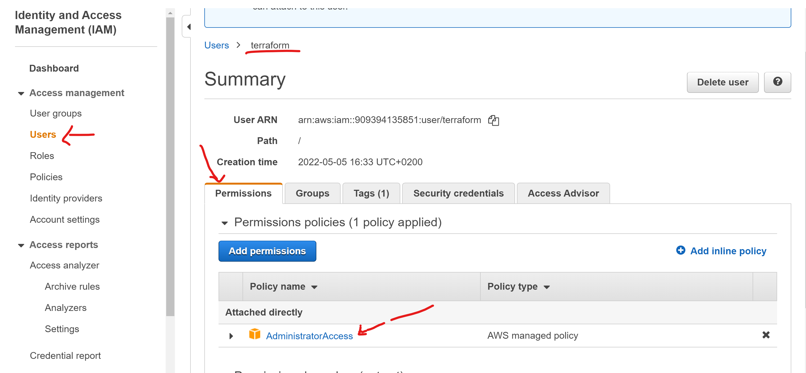
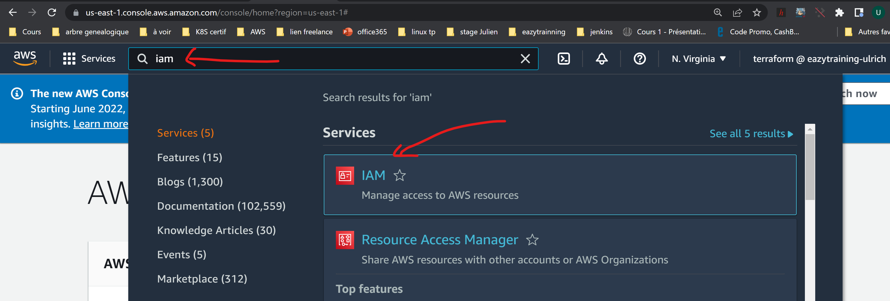
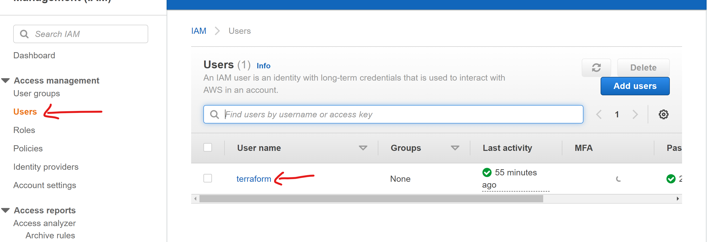
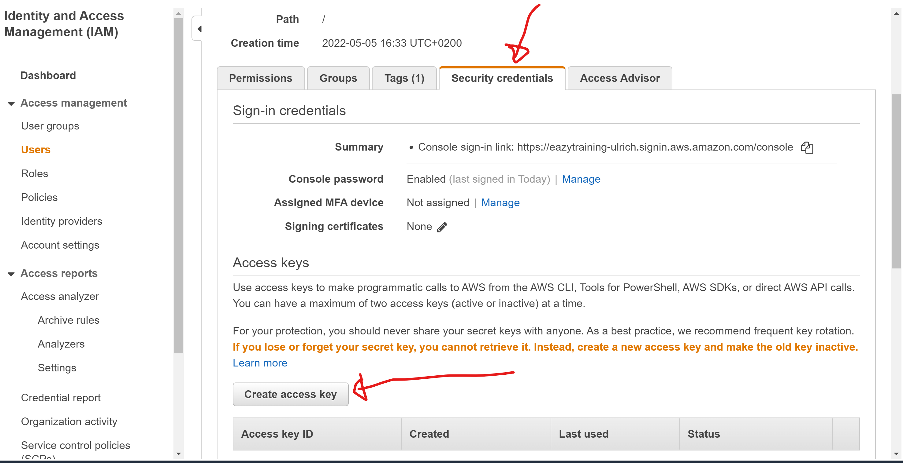
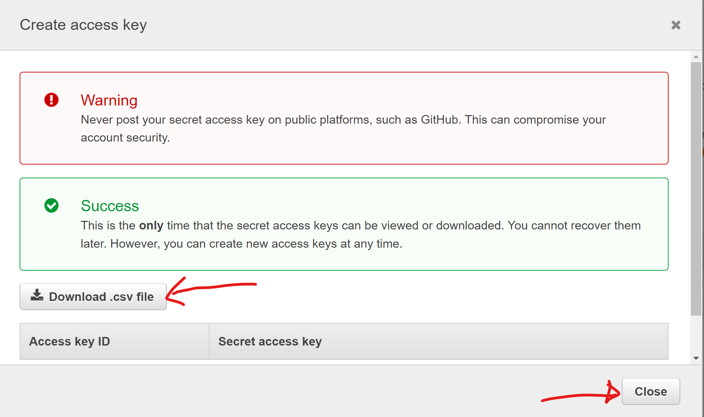
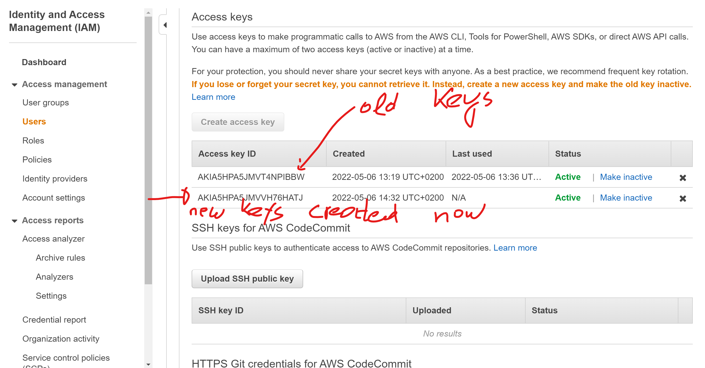
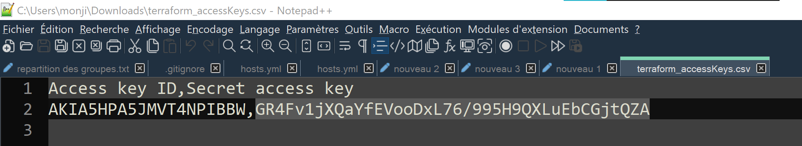

# AWS PURGE
## Objectifs
Ce repertoire contient un script vous permettant de **nettoyer le compte aws** ou de **re-créer le VPC par défaut**
Pour faire la purge de votre compte AWS, il suffit d'exécuter le script **aws_purge.sh** sur un système Linux ***dérivé de Redhat***
Le script seul suffit, il va installer tout ce dont il a besoin de dépendances. Il ne prend pas encore en compte les autres distributions **Linux** (**debian**, **ubuntu**, etc ...)

## Prérequis
- Un OS **Redhat** ou dérivé (**Fedora**, **Centos**, etc...)
- Le shell **Bash** présent sur cet OS
- L'accès Root sur votre VM
- Votre **id de compte aws**
- Votre **access keys** aws
- Votre **secret key** aws
- Ces credentials doivent avoir les droits nécessaires dans aws pour supprimer les ressources (la policy **AdministratorAccess** fera l'affaire...)

## Indications supplémentaires
#### Permission du compte aws (Policy)
Dans notre cas, on dispose d'un compte **IAM** dans AWS, nommé **terraform**. Ci dessous comment vérifier/ajouter des Policy à ce compte : 
    

#### ID de compte aws
Il est disponible dans votre console aws apres connexions.

#### Access key et Secret key aws
Si vous n'en disposez pas, il faudrait aller dans le service **IAM** de aws, et créer vos access et secret keys.
Voici quelques captures pour vous aider : 
- Aller dans le servive IAM de aws
    
- Selectionnez votre user (**terraform** dans mon cas)
    
- Créer la paire de clés si elle n'existe pas
    
- Sauvegarder et garder jalousement le fichier généré
    
- Vérifier que la clés est bien disponible dans aws
    
- Ouvrir le fichier téléchargé et valider que vous avez bien vous tokens
    

## Documentations annexe utile.
- **Creation du default VPC**  : https://docs.aws.amazon.com/vpc/latest/userguide/default-vpc.html#create-default-vpc
- **Installation de la cli aws v2**: https://docs.aws.amazon.com/cli/latest/userguide/install-cliv2-linux.html
- **Configuration de la cli avec les access et secret key** : https://docs.aws.amazon.com/cli/latest/userguide/cli-configure-quickstart.html
